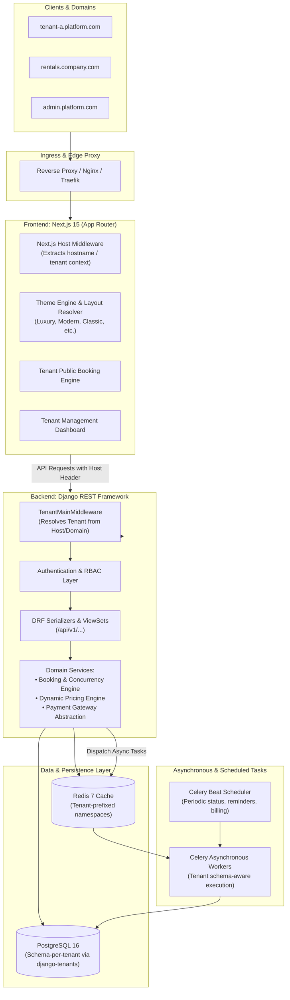

# Master Architecture Specification

## 1. Executive Summary & Product Vision

The **Car Rental SaaS Platform** is a multi-tenant operating system designed for independent car rental operators. It provides:
- **A high-converting, premium public website** for each rental company, customized with distinct automotive themes, tenant branding, dynamic vehicle catalogs, and an instant booking checkout flow.
- **A management dashboard** empowering rental operators to manage fleet assets, multiple pickup/return branches, customer profiles, calendar reservations, pricing rules, payment ledgers, maintenance workflows, staff access, and analytical reports.
- **Robust Multi-Tenancy**: Zero data leakage across tenants, achieved through schema-level database isolation, tenant-scoped caching, and strict server-side tenant resolution.

---

## 2. High-Level System Architecture



---

## 3. Core Architectural Boundaries

### 3.1 Repository Decoupling
Frontend and backend are maintained as **two distinct, autonomous Git repositories**:
- `frontend/`: Pure TypeScript Next.js 15 application utilizing Server Components, Tailwind CSS, shadcn/ui primitives, and Framer Motion.
- `backend/`: Pure Python Django 5 application utilizing `django-tenants`, DRF, Celery, and `drf-spectacular`.

### 3.2 Tenant Isolation Guarantee
1. **Database Schema Isolation**: Data separation is physically enforced at the PostgreSQL engine level. Tenant queries only ever execute on the tenant's dedicated PostgreSQL schema (e.g. `tenant_acme`).
2. **Server-Side Host Resolution**: Tenants are resolved exclusively through the incoming HTTP `Host` header via the `domains` table. Under no circumstances will query parameters like `?tenant_id=123` or client-supplied bodies dictate tenant authorization.
3. **Tenant-Aware Cache Layer**: All Redis keys are strictly formatted as `tenant:{tenant_id}:{subsystem}:{key}`. Shared caches without tenant prefixes are forbidden.
4. **Celery Schema Context**: Asynchronous tasks accept `tenant_schema_name` and execute within `tenant_context(tenant)`.

### 3.3 Separation of Concerns: View vs Service vs Selector
To ensure maintainability, business logic is explicitly isolated:
```text
HTTP Request
     │
     ▼
API ViewSet / View  <--- Parses requests, validates permissions, returns HTTP response
     │
     ▼
Serializer          <--- Validates schema structure & formats output representations
     │
     ▼
Service Layer       <--- Executes business logic, transactions, concurrency locks
     │
     ▼
Domain / Models     <--- Encapsulates table schemas, field rules, and properties
     │
     ▼
PostgreSQL Database
```

---

## 4. Key Subsystems

| Subsystem | Responsibilities | Key Technologies |
| :--- | :--- | :--- |
| **Multi-Tenancy Engine** | Schema migration, domain resolution, public vs tenant app routing | `django-tenants`, PostgreSQL schemas |
| **Identity & Membership** | Global user accounts, tenant memberships, multi-tenant roles | DRF, SimpleJWT, custom RBAC |
| **Fleet & Branch Operations** | Vehicle models, specs, images, tracking status, branch locations | Django ORM, Storage abstraction |
| **Booking & Availability Engine** | Reservation lifecycle, datetime conflict resolution, double-booking prevention | PostgreSQL `select_for_update`, transactions |
| **Pricing Engine** | Daily/weekly rates, seasonal multipliers, weekend surcharges, coupon discounts | Python service module |
| **Payments & Invoicing** | Abstracted payment provider adapters (Stripe, eSewa, Khalti), webhook idempotency | Strategy pattern, ledger models |
| **Background Processing** | Asynchronous email dispatch, overdue return checks, cleanup jobs | Celery, Celery Beat, Redis |
| **Theme Engine** | Multi-theme registry, dynamic theme component dispatching, branding token injection | Next.js dynamic components, CSS variables |
| **Tenant Dashboard** | Modern operational dashboard with data visualization, CRUD tables, and workflows | Next.js Server & Client Components, shadcn/ui |

---

## 5. Security Architecture & Threat Model

1. **Broken Object Level Authorization (BOLA/IDOR)**:
   - Eliminated by schema isolation. An ID belonging to Tenant B does not exist in Tenant A's PostgreSQL schema; querying it returns a natural `404 Not Found`.
2. **Privilege Escalation**:
   - Role verification is evaluated strictly against the user's `Membership` record in the target tenant schema. Platform admins have controlled elevation rights.
3. **Data Leakage in Shared Infrastructure**:
   - Cache keys and search indices are partitioned by tenant identifier.
4. **Payment Webhook Spoofing**:
   - Webhooks are cryptographically validated using provider signatures with idempotency tracking to prevent replay attacks.
