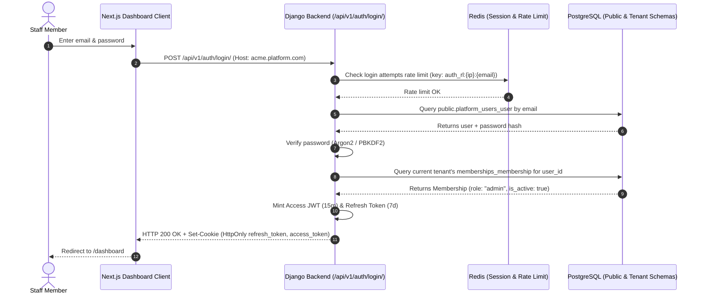

# Unified Identity & Authentication Architecture

## 1. Principles of Platform Identity

1. **Single Identity, Multiple Tenants**:
   A human user has one email and one password stored globally in the `public` schema (`platform_users_user`). They can hold memberships across multiple independent car rental companies without creating separate accounts.
   ```text
   Global User (john@example.com)
         ├── Tenant "Alpha Rentals"   -> Role: Owner
         ├── Tenant "Beta Luxury Cars" -> Role: Manager
         └── Tenant "Gamma Fleet"      -> Role: Viewer
   ```
2. **Zero Duplicate Accounts**:
   Tenant creation or invitation attaches a new `Membership` in that tenant's schema to the user's global `UUID`.
3. **Stateless JWT with Secure HttpOnly Cookies**:
   Authentication tokens use short-lived access tokens (15 minutes) and rotating refresh tokens (7 days) stored in `HttpOnly`, `SameSite=Lax`, `Secure` cookies to prevent XSS exfiltration.

---

## 2. Authentication Flow



---

## 3. JWT Claims Specification

```json
{
  "iss": "car-rental-saas-auth",
  "sub": "b2f671c5-8f6a-4933-bf46-9d3e8e19e072",
  "email": "sarah.admin@acmerentals.com",
  "name": "Sarah Connor",
  "is_platform_admin": false,
  "exp": 1790184000,
  "iat": 1790183100,
  "jti": "8f8c47b5-27a9-467f-94ad-962f360bb80d"
}
```
*Note: The tenant role is NOT statically embedded in the JWT.* Role verification queries the active tenant's `memberships_membership` table (cached in Redis with a 5-minute TTL). This prevents privilege retention if a user's role is revoked or modified mid-session.

---

## 4. Account Onboarding & Invitation Pipeline

1. **Tenant Owner Signup**:
   - Creates global `User` in `public` schema.
   - Provisions new `Tenant` record with dedicated PostgreSQL schema.
   - Links `Domain` mapping.
   - Creates initial `Membership` with `role="owner"`.
   - Executes `migrate_schemas` for the new tenant.
2. **Staff Invitation**:
   - Admin/Owner inputs email and desired role in dashboard.
   - An invitation token is generated with a 48-hour expiration.
   - Celery sends an invitation email containing a secure acceptance link.
   - Recipient accepts: if an existing user, membership attaches immediately; if new, they set their name and password first.

---

## 5. Security Controls & Rate Limiting

- **Brute Force Protection**: Maximum 5 failed login attempts per email/IP pair per 15 minutes, enforced via Redis sliding window counters.
- **Password Policy**: Minimum 10 characters, requiring uppercase, lowercase, numbers, and symbols. Checked against HaveIBeenPwned common password lists.
- **Session Invalidation**: Users can invoke "Logout All Devices", which revokes all active refresh tokens in Redis.
