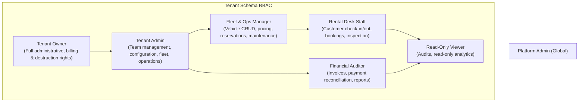

# Role-Based Access Control (RBAC) & Authorization Architecture

## 1. Role Hierarchy & Principles

Authorization in the Car Rental SaaS operates on two distinct planes:
1. **Platform Plane**: Global platform administrators who oversee infrastructure, subscriptions, and system health.
2. **Tenant Plane**: Company-specific operational roles that govern fleet assets, reservations, and financials.



---

## 2. Granular Permission Matrix

| Resource / Action | Owner | Admin | Manager | Staff | Accountant | Viewer |
| :--- | :---: | :---: | :---: | :---: | :---: | :---: |
| **Delete Tenant / Change Subdomain** | ✅ | ❌ | ❌ | ❌ | ❌ | ❌ |
| **Manage Subscription & Billing** | ✅ | ❌ | ❌ | ❌ | ❌ | ❌ |
| **Invite & Remove Team Members** | ✅ | ✅ | ❌ | ❌ | ❌ | ❌ |
| **Change Website Branding & Theme** | ✅ | ✅ | ❌ | ❌ | ❌ | ❌ |
| **Configure Branches & Operating Hours** | ✅ | ✅ | ✅ | ❌ | ❌ | ❌ |
| **Create / Edit Pricing & Seasonal Rates** | ✅ | ✅ | ✅ | ❌ | ❌ | ❌ |
| **Add / Edit Vehicles (Fleet)** | ✅ | ✅ | ✅ | ❌ | ❌ | ❌ |
| **Schedule Maintenance Work Orders** | ✅ | ✅ | ✅ | ✅ | ❌ | ❌ |
| **Create / Modify Bookings** | ✅ | ✅ | ✅ | ✅ | ❌ | ❌ |
| **Process Vehicle Check-In / Check-Out** | ✅ | ✅ | ✅ | ✅ | ❌ | ❌ |
| **View Customer Driver Licenses & PII** | ✅ | ✅ | ✅ | ✅ | ❌ | ❌ |
| **Process Payment Refunds & Adjustments** | ✅ | ✅ | ❌ | ❌ | ✅ | ❌ |
| **Export Financial & Tax Reports** | ✅ | ✅ | ❌ | ❌ | ✅ | ❌ |
| **View Fleet Availability & Calendar** | ✅ | ✅ | ✅ | ✅ | ✅ | ✅ |
| **View Audit Logs** | ✅ | ✅ | ❌ | ❌ | ❌ | ❌ |

---

## 3. Server-Side Enforcement Architecture

Under no circumstance does the backend trust claims or role headers from the client. Authorization is verified via Django REST Framework permission classes:

```python
from rest_framework.permissions import BasePermission
from apps.tenant.memberships.models import Membership

class HasTenantRole(BasePermission):
    """
    Validates that the authenticated user holds an active membership
    with one of the permitted roles within the current tenant schema.
    """
    def __init__(self, allowed_roles: list[str]):
        self.allowed_roles = allowed_roles

    def has_permission(self, request, view):
        if not request.user or not request.user.is_authenticated:
            return False

        # Platform superadmins can bypass tenant restrictions for support
        if getattr(request.user, "is_platform_admin", False):
            return True

        membership = getattr(request, "tenant_membership", None)
        if not membership or not membership.is_active:
            return False

        return membership.role in self.allowed_roles
```

### 3.1 Tenant Membership Middleware
During request processing, after `TenantMainMiddleware` activates the tenant schema, a downstream authentication middleware resolves the user's `Membership`:

```python
class TenantMembershipMiddleware:
    def __init__(self, get_response):
        self.get_response = get_response

    def __call__(self, request):
        if request.user.is_authenticated:
            try:
                request.tenant_membership = Membership.objects.get(
                    user_id=request.user.id,
                    is_active=True
                )
            except Membership.DoesNotExist:
                request.tenant_membership = None
        else:
            request.tenant_membership = None

        return self.get_response(request)
```

---

## 4. Object-Level Authorization (Multi-Branch Scoping)

For large rental enterprises with multiple branches:
- Staff members can be restricted to specific branches via `MembershipBranchAssignment`.
- Staff attempting to modify reservations originating from a branch outside their jurisdiction receive `403 Forbidden`.
- Managers and Owners retain multi-branch visibility across the entire tenant enterprise.
