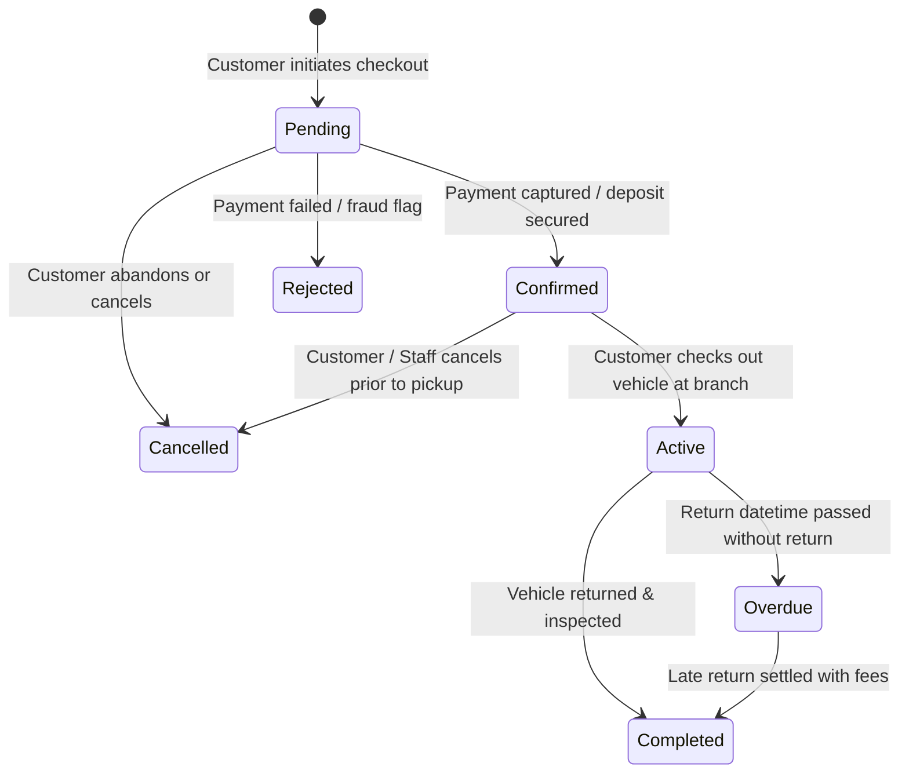
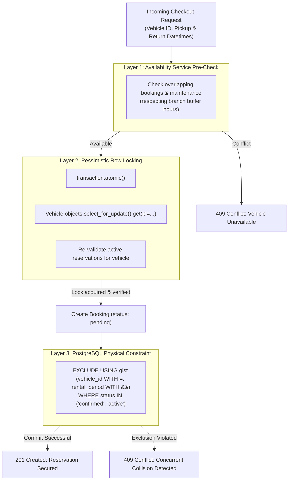

# Booking Engine & Concurrency Protection Specification

## 1. Booking State Machine

The reservation lifecycle represents the core business process of the rental enterprise:



### 1.1 State Definitions
- **`pending`**: Temporary reservation held while the payment gateway processes the transaction (TTL: 15 minutes).
- **`confirmed`**: Legally binding reservation. Vehicle is officially committed and unavailable to others.
- **`active`**: Renter has picked up keys, vehicle condition inspection report signed, odometer recorded.
- **`completed`**: Vehicle returned to branch, final inspection executed, deposit refunded or adjusted.
- **`cancelled`**: Booking aborted by renter or operator; cancellation policy applied.
- **`rejected`**: Auto-aborted due to payment failure or failed customer identity check.

---

## 2. Multi-Layered Double-Booking Prevention

Preventing two customers from simultaneously reserving the same vehicle is a safety-critical requirement. We implement a **defense-in-depth model** with three distinct safeguards:



### 2.1 Layer 1: Availability Service
Prior to taking customer payment details, the `AvailabilityService` calculates eligible fleet inventory:
```python
class AvailabilityService:
    @staticmethod
    def is_vehicle_available(
        vehicle_id: str,
        pickup_dt: datetime,
        return_dt: datetime,
        buffer_hours: int = 2
    ) -> bool:
        # Buffer accounts for cleaning, safety check, and turnaround
        effective_start = pickup_dt - timedelta(hours=buffer_hours)
        effective_end = return_dt + timedelta(hours=buffer_hours)
        
        # 1. Check existing confirmed or active bookings
        conflicts = Booking.objects.filter(
            vehicle_id=vehicle_id,
            status__in=["confirmed", "active", "pending"],
            pickup_datetime__lt=effective_end,
            return_datetime__gt=effective_start,
        )
        if conflicts.exists():
            return False

        # 2. Check scheduled maintenance
        maintenance_conflicts = MaintenanceRecord.objects.filter(
            vehicle_id=vehicle_id,
            status__in=["scheduled", "in_progress"],
            scheduled_start__lt=effective_end,
            scheduled_end__gt=effective_start,
        )
        return not maintenance_conflicts.exists()
```

### 2.2 Layer 2: Pessimistic Row Locking (`select_for_update`)
During checkout execution, when two concurrent threads pass Layer 1 simultaneously, transactional row-level locking forces serialization:
```python
from django.db import transaction

def secure_booking_creation(vehicle_id: str, customer_id: str, pickup_dt: datetime, return_dt: datetime):
    with transaction.atomic():
        # Lock the vehicle row against concurrent reservation attempts
        vehicle = Vehicle.objects.select_for_update().get(id=vehicle_id)
        
        # Re-verify availability inside locked transaction
        if not AvailabilityService.is_vehicle_available(vehicle.id, pickup_dt, return_dt):
            raise BookingConflictException("Vehicle was just reserved by another customer.")
            
        booking = Booking.objects.create(
            vehicle=vehicle,
            customer_id=customer_id,
            pickup_datetime=pickup_dt,
            return_datetime=return_dt,
            status="pending"
        )
        return booking
```

### 2.3 Layer 3: PostgreSQL Exclusion Constraint
Even if application logic fails or raw SQL queries bypass Django ORM, the PostgreSQL kernel enforces non-overlapping intervals:
```sql
ALTER TABLE bookings_booking
ADD CONSTRAINT no_overlapping_active_bookings
EXCLUDE USING gist (
    vehicle_id WITH =,
    tstzrange(pickup_datetime, return_datetime, '[)') WITH &&
)
WHERE (status IN ('confirmed', 'active'));
```

---

## 3. Rental Operations: Check-In & Check-Out Workflow

1. **Pickup (Check-Out)**:
   - Verification of physical Driver's License and match with customer profile.
   - Recording initial odometer reading (must match or exceed previous return).
   - Digital fuel level entry (percentage or 8ths).
   - Digital Walkaround Inspection (photo capture of existing scratches/dents stored via storage abstraction).
   - Customer digital signature capture.
   - Booking transitions to `active`.

2. **Return (Check-In)**:
   - Recording final odometer reading.
   - Comparison with mileage allowance (calculates excess mileage charge if applicable).
   - Recording return fuel level (calculates refueling surcharge if below pickup level).
   - Damage inspection: new damages flagged for deposit deduction.
   - Booking transitions to `completed`.
   - Security deposit release or charge triggered via `PaymentService`.
