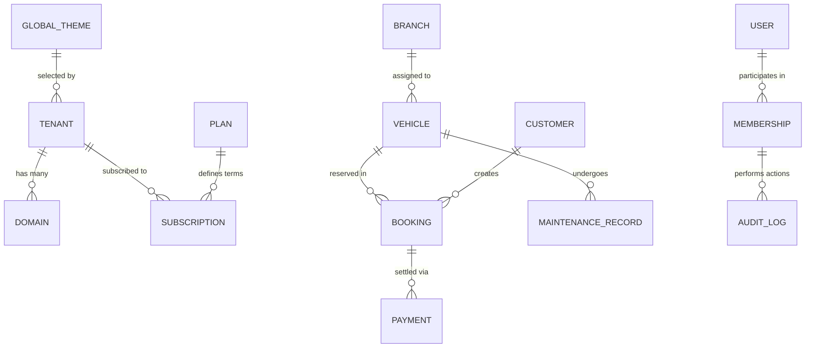

# Database Architecture & Entity Specifications

## 1. Schema Separation Overview

The platform uses PostgreSQL schemas to separate platform governance from tenant operations:



---

## 2. Public Schema Entities

### 2.1 `tenants_tenant` (Public)
The primary tenant record managed by `TenantMixin` from `django-tenants`.
```sql
CREATE TABLE public.tenants_tenant (
    id UUID PRIMARY KEY DEFAULT gen_random_uuid(),
    schema_name VARCHAR(63) UNIQUE NOT NULL,
    name VARCHAR(120) NOT NULL,
    slug VARCHAR(63) UNIQUE NOT NULL,
    is_active BOOLEAN NOT NULL DEFAULT TRUE,
    timezone VARCHAR(50) NOT NULL DEFAULT 'UTC',
    currency VARCHAR(3) NOT NULL DEFAULT 'USD',
    created_at TIMESTAMPTZ NOT NULL DEFAULT NOW(),
    updated_at TIMESTAMPTZ NOT NULL DEFAULT NOW()
);
CREATE INDEX idx_tenant_schema ON public.tenants_tenant (schema_name);
CREATE INDEX idx_tenant_slug ON public.tenants_tenant (slug);
```

### 2.2 `domains_domain` (Public)
Domain routing mapping managed by `DomainMixin`.
```sql
CREATE TABLE public.domains_domain (
    id UUID PRIMARY KEY DEFAULT gen_random_uuid(),
    domain VARCHAR(253) UNIQUE NOT NULL,
    tenant_id UUID NOT NULL REFERENCES public.tenants_tenant(id) ON DELETE CASCADE,
    is_primary BOOLEAN NOT NULL DEFAULT FALSE,
    is_verified BOOLEAN NOT NULL DEFAULT FALSE,
    created_at TIMESTAMPTZ NOT NULL DEFAULT NOW()
);
CREATE INDEX idx_domain_name ON public.domains_domain (domain);
```

### 2.3 `platform_users_user` (Public)
Global platform identity. Users log in with one credential set regardless of how many rental companies they belong to.
```sql
CREATE TABLE public.platform_users_user (
    id UUID PRIMARY KEY DEFAULT gen_random_uuid(),
    email VARCHAR(255) UNIQUE NOT NULL,
    password_hash VARCHAR(255) NOT NULL,
    first_name VARCHAR(60) NOT NULL,
    last_name VARCHAR(60) NOT NULL,
    phone_number VARCHAR(30) NULL,
    is_platform_admin BOOLEAN NOT NULL DEFAULT FALSE,
    is_active BOOLEAN NOT NULL DEFAULT TRUE,
    created_at TIMESTAMPTZ NOT NULL DEFAULT NOW(),
    updated_at TIMESTAMPTZ NOT NULL DEFAULT NOW()
);
CREATE INDEX idx_user_email ON public.platform_users_user (email);
```

---

## 3. Tenant Schema Entities (per `tenant_<id>`)

### 3.1 `memberships_membership`
Maps a global user to a specific tenant role.
```sql
CREATE TABLE tenant_x.memberships_membership (
    id UUID PRIMARY KEY DEFAULT gen_random_uuid(),
    user_id UUID NOT NULL, -- Logical reference to public.platform_users_user(id)
    role VARCHAR(20) NOT NULL CHECK (role IN ('owner', 'admin', 'manager', 'staff', 'accountant', 'viewer')),
    is_active BOOLEAN NOT NULL DEFAULT TRUE,
    invited_email VARCHAR(255) NULL,
    created_at TIMESTAMPTZ NOT NULL DEFAULT NOW(),
    updated_at TIMESTAMPTZ NOT NULL DEFAULT NOW(),
    CONSTRAINT uq_tenant_user UNIQUE (user_id)
);
```

### 3.2 `branches_branch`
Locations where vehicles can be picked up or returned.
```sql
CREATE TABLE tenant_x.branches_branch (
    id UUID PRIMARY KEY DEFAULT gen_random_uuid(),
    name VARCHAR(100) NOT NULL,
    code VARCHAR(10) NOT NULL,
    address_line1 VARCHAR(255) NOT NULL,
    address_line2 VARCHAR(255) NULL,
    city VARCHAR(100) NOT NULL,
    state VARCHAR(100) NULL,
    postal_code VARCHAR(20) NOT NULL,
    country VARCHAR(2) NOT NULL,
    latitude DECIMAL(9,6) NULL,
    longitude DECIMAL(9,6) NULL,
    phone VARCHAR(30) NOT NULL,
    email VARCHAR(255) NOT NULL,
    is_active BOOLEAN NOT NULL DEFAULT TRUE,
    created_at TIMESTAMPTZ NOT NULL DEFAULT NOW(),
    updated_at TIMESTAMPTZ NOT NULL DEFAULT NOW()
);
```

### 3.3 `vehicles_vehicle`
Physical fleet inventory.
```sql
CREATE TABLE tenant_x.vehicles_vehicle (
    id UUID PRIMARY KEY DEFAULT gen_random_uuid(),
    branch_id UUID NOT NULL REFERENCES tenant_x.branches_branch(id) ON DELETE RESTRICT,
    brand VARCHAR(60) NOT NULL,
    model VARCHAR(60) NOT NULL,
    year INT NOT NULL CHECK (year BETWEEN 1990 AND 2050),
    license_plate VARCHAR(20) UNIQUE NOT NULL,
    vin VARCHAR(17) UNIQUE NULL,
    category VARCHAR(30) NOT NULL CHECK (category IN ('economy', 'compact', 'sedan', 'suv', 'luxury', 'sports', 'van', 'electric')),
    transmission VARCHAR(20) NOT NULL CHECK (transmission IN ('automatic', 'manual')),
    fuel_type VARCHAR(20) NOT NULL CHECK (fuel_type IN ('petrol', 'diesel', 'hybrid', 'electric')),
    seats INT NOT NULL CHECK (seats BETWEEN 1 AND 50),
    doors INT NOT NULL CHECK (doors BETWEEN 2 AND 10),
    mileage INT NOT NULL DEFAULT 0,
    color VARCHAR(30) NOT NULL,
    status VARCHAR(20) NOT NULL DEFAULT 'available' CHECK (status IN ('available', 'reserved', 'rented', 'maintenance', 'inactive')),
    daily_rate DECIMAL(10,2) NOT NULL,
    weekly_rate DECIMAL(10,2) NULL,
    monthly_rate DECIMAL(10,2) NULL,
    deposit_amount DECIMAL(10,2) NOT NULL DEFAULT 0.00,
    features JSONB NOT NULL DEFAULT '[]'::jsonb,
    images JSONB NOT NULL DEFAULT '[]'::jsonb, -- Array of storage keys & URLs
    description TEXT NULL,
    created_at TIMESTAMPTZ NOT NULL DEFAULT NOW(),
    updated_at TIMESTAMPTZ NOT NULL DEFAULT NOW()
);
CREATE INDEX idx_vehicle_status ON tenant_x.vehicles_vehicle (status);
CREATE INDEX idx_vehicle_category ON tenant_x.vehicles_vehicle (category);
CREATE INDEX idx_vehicle_branch ON tenant_x.vehicles_vehicle (branch_id);
```

### 3.4 `customers_customer`
Renters/clients associated with this tenant.
```sql
CREATE TABLE tenant_x.customers_customer (
    id UUID PRIMARY KEY DEFAULT gen_random_uuid(),
    first_name VARCHAR(60) NOT NULL,
    last_name VARCHAR(60) NOT NULL,
    email VARCHAR(255) NOT NULL,
    phone VARCHAR(30) NOT NULL,
    driver_license_number VARCHAR(50) NOT NULL,
    license_expiry_date DATE NOT NULL,
    date_of_birth DATE NOT NULL,
    country VARCHAR(2) NOT NULL,
    created_at TIMESTAMPTZ NOT NULL DEFAULT NOW(),
    updated_at TIMESTAMPTZ NOT NULL DEFAULT NOW()
);
CREATE INDEX idx_customer_email ON tenant_x.customers_customer (email);
CREATE INDEX idx_customer_license ON tenant_x.customers_customer (driver_license_number);
```

### 3.5 `bookings_booking`
Core reservation record.
```sql
CREATE TABLE tenant_x.bookings_booking (
    id UUID PRIMARY KEY DEFAULT gen_random_uuid(),
    booking_reference VARCHAR(12) UNIQUE NOT NULL,
    vehicle_id UUID NOT NULL REFERENCES tenant_x.vehicles_vehicle(id) ON DELETE RESTRICT,
    customer_id UUID NOT NULL REFERENCES tenant_x.customers_customer(id) ON DELETE RESTRICT,
    pickup_branch_id UUID NOT NULL REFERENCES tenant_x.branches_branch(id) ON DELETE RESTRICT,
    return_branch_id UUID NOT NULL REFERENCES tenant_x.branches_branch(id) ON DELETE RESTRICT,
    pickup_datetime TIMESTAMPTZ NOT NULL,
    return_datetime TIMESTAMPTZ NOT NULL,
    rental_period TSTZRANGE GENERATED ALWAYS AS (tstzrange(pickup_datetime, return_datetime, '[)')) STORED,
    status VARCHAR(20) NOT NULL DEFAULT 'pending' CHECK (status IN ('pending', 'confirmed', 'active', 'completed', 'cancelled', 'rejected')),
    base_price DECIMAL(10,2) NOT NULL,
    discount_amount DECIMAL(10,2) NOT NULL DEFAULT 0.00,
    tax_amount DECIMAL(10,2) NOT NULL DEFAULT 0.00,
    deposit_amount DECIMAL(10,2) NOT NULL DEFAULT 0.00,
    total_price DECIMAL(10,2) NOT NULL,
    payment_status VARCHAR(20) NOT NULL DEFAULT 'unpaid' CHECK (payment_status IN ('unpaid', 'partially_paid', 'paid', 'refunded')),
    notes TEXT NULL,
    created_at TIMESTAMPTZ NOT NULL DEFAULT NOW(),
    updated_at TIMESTAMPTZ NOT NULL DEFAULT NOW(),
    CONSTRAINT chk_booking_dates CHECK (return_datetime > pickup_datetime)
);
CREATE INDEX idx_booking_ref ON tenant_x.bookings_booking (booking_reference);
CREATE INDEX idx_booking_vehicle_dates ON tenant_x.bookings_booking (vehicle_id, pickup_datetime, return_datetime);
CREATE INDEX idx_booking_status ON tenant_x.bookings_booking (status);
```

### 3.6 Concurrency Protection Constraint (PostgreSQL Extension)
Using PostgreSQL `btree_gist`, overlapping bookings for the same vehicle in active statuses (`confirmed`, `active`) can be physically prevented at the database level:
```sql
-- Extension installed in public schema
CREATE EXTENSION IF NOT EXISTS btree_gist;

-- Constraint in tenant schema
ALTER TABLE tenant_x.bookings_booking
ADD CONSTRAINT no_overlapping_active_bookings
EXCLUDE USING gist (
    vehicle_id WITH =,
    rental_period WITH &&
)
WHERE (status IN ('confirmed', 'active'));
```

### 3.7 `payments_payment`
Financial transactions and gateway ledger.
```sql
CREATE TABLE tenant_x.payments_payment (
    id UUID PRIMARY KEY DEFAULT gen_random_uuid(),
    booking_id UUID NOT NULL REFERENCES tenant_x.bookings_booking(id) ON DELETE RESTRICT,
    provider VARCHAR(30) NOT NULL CHECK (provider IN ('stripe', 'esewa', 'khalti', 'paypal', 'bank_transfer', 'cash')),
    transaction_reference VARCHAR(120) UNIQUE NOT NULL,
    amount DECIMAL(10,2) NOT NULL,
    currency VARCHAR(3) NOT NULL DEFAULT 'USD',
    status VARCHAR(20) NOT NULL DEFAULT 'pending' CHECK (status IN ('pending', 'succeeded', 'failed', 'refunded')),
    idempotency_key VARCHAR(120) UNIQUE NOT NULL,
    payload JSONB NOT NULL DEFAULT '{}'::jsonb,
    error_message TEXT NULL,
    created_at TIMESTAMPTZ NOT NULL DEFAULT NOW(),
    updated_at TIMESTAMPTZ NOT NULL DEFAULT NOW()
);
CREATE INDEX idx_payment_booking ON tenant_x.payments_payment (booking_id);
CREATE INDEX idx_payment_idempotency ON tenant_x.payments_payment (idempotency_key);
```
