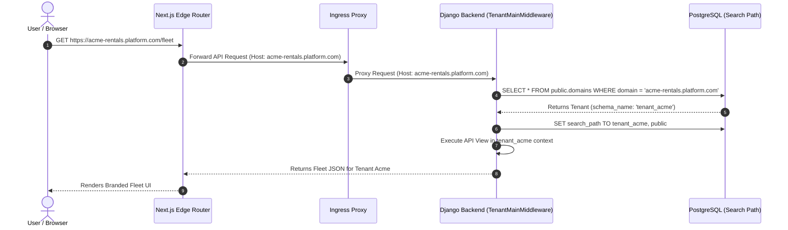

# Multi-Tenancy Architecture Specification

## 1. Tenancy Model: PostgreSQL Schema Isolation

In multi-tenant SaaS architectures, three isolation paradigms exist:
1. **Shared Database, Shared Schema (Row-Level Security / Tenant Column)**: Prone to developer error, where a missing `WHERE tenant_id = x` exposes private customer data.
2. **Database-per-Tenant**: Maximum isolation, but prohibitive operational overhead, excessive connection pools, and high infrastructure cost for hundreds of tenants.
3. **Schema-per-Tenant (Chosen Architecture)**: The optimal sweet spot. A single PostgreSQL database hosts separate PostgreSQL schemas (`public`, `tenant_alpha`, `tenant_beta`).

We utilize **`django-tenants`** to manage schema generation, migrations, and runtime routing.

---

## 2. Public vs Tenant Application Separation

Django apps are split into `SHARED_APPS` and `TENANT_APPS` in settings:

```python
SHARED_APPS = [
    "django_tenants",
    "django.contrib.admin",
    "django.contrib.auth",
    "django.contrib.contenttypes",
    "django.contrib.sessions",
    "django.contrib.messages",
    "django.contrib.staticfiles",
    "rest_framework",
    "rest_framework_simplejwt",
    "drf_spectacular",
    # Platform Apps (Public Schema Only)
    "apps.platform.tenants",
    "apps.platform.domains",
    "apps.platform.subscriptions",
    "apps.platform.plans",
    "apps.platform.platform_users",
    "apps.platform.themes",
]

TENANT_APPS = [
    "django.contrib.contenttypes",
    "django.contrib.auth",
    # Tenant Apps (Executed within tenant_x schemas)
    "apps.tenant.memberships",
    "apps.tenant.branches",
    "apps.tenant.vehicles",
    "apps.tenant.customers",
    "apps.tenant.bookings",
    "apps.tenant.pricing",
    "apps.tenant.payments",
    "apps.tenant.maintenance",
    "apps.tenant.notifications",
    "apps.tenant.websites",
    "apps.tenant.reports",
    "apps.tenant.audit",
]
```

### 2.1 Public Schema Responsibilities
- **`Tenant` Model**: Stores tenant identifier (`schema_name`), business name, creation timestamp, subscription status, and tenant configuration.
- **`Domain` Model**: Maps subdomains (e.g. `luxury.platform.com`) and custom domains (e.g. `www.luxurymotors.com`) to a specific `Tenant`.
- **`PlatformUser` / Global Auth**: Central user identity store. Users authenticate once with email and password.
- **`Subscription` & `Plan`**: Tracks tier capabilities (fleet size limits, custom domain enablement, theme access).
- **`GlobalThemes`**: Master theme definitions available on the platform.

### 2.2 Tenant Schema Responsibilities
- **`Membership`**: Relates a central user to this specific tenant with a granular role (`owner`, `admin`, `manager`, `staff`, `accountant`, `viewer`).
- **Fleet & Operations**: All `branches`, `vehicles`, `customers`, `bookings`, `pricing_rules`, `payments`, `maintenance_logs`, `audit_logs`, and `website_settings`.
- **Zero Cross-Contamination**: At the PostgreSQL engine level, running `SELECT * FROM vehicles;` when the search path is set to `tenant_a` will physically never see `tenant_b` data.

---

## 3. Server-Side Tenant Resolution Flow



### 3.1 Strict Security Rules for Resolution
1. **Never Accept Client-Specified Tenant Overrides**: Under no conditions will `?tenant_id=`, `?schema=`, or request payload attributes determine which tenant schema executes. The HTTP `Host` header (cross-verified by edge reverse proxy) is the single source of truth.
2. **Missing Domain Handling**: If a request comes in with an unrecognized Host, Django immediately returns `404 Domain Not Found`.
3. **Tenant Inactive State**: If `tenant.is_active is False`, all requests are terminated with `403 Tenant Suspended`.

---

## 4. Asynchronous & Celery Multi-Tenancy

Because Celery runs outside the HTTP request/response cycle, the search path must be explicitly activated before executing any database operations.

```python
from celery import shared_task
from django_tenants.utils import schema_context, get_tenant_model

@shared_task(bind=True, max_retries=3)
def process_overdue_reminders(self, tenant_schema_name: str):
    TenantModel = get_tenant_model()
    try:
        tenant = TenantModel.objects.get(schema_name=tenant_schema_name)
    except TenantModel.DoesNotExist:
        return

    with schema_context(tenant.schema_name):
        # All ORM queries in this block execute on tenant.schema_name
        from apps.tenant.bookings.services import check_overdue_rentals
        check_overdue_rentals()
```

---

## 5. Schema Migration Workflow

Migrations are managed with `django-tenants` commands:
- `python manage.py makemigrations`: Creates standard migrations for apps.
- `python manage.py migrate_schemas`: Migrates `public` first, then dynamically iterates through all active tenant schemas.
- `python manage.py migrate_schemas --schema=public`: Migrates only public apps.
- `python manage.py migrate_schemas --schema=tenant_acme`: Migrates an isolated tenant schema for targeted updates or debugging.

---

## 6. Frontend Multi-Tenancy Resolution (Next.js)

Next.js handles multi-tenancy at the Edge Middleware level:
1. `middleware.ts` extracts `req.headers.get("host")`.
2. Normalizes hostname (e.g. `acme.platform.com` -> subdomain `acme`).
3. Sets request headers `x-tenant-host: acme.platform.com` and `x-tenant-slug: acme`.
4. Dispatches requests to the appropriate route group:
   - `/(public)` for tenant customer-facing rental portal.
   - `/(dashboard)` for authenticated fleet management console.
   - `/(platform)` for super-admin platform administration.
5. All backend fetch calls from Server Components forward the `Host` header to Django to ensure synchronized tenant resolution.
