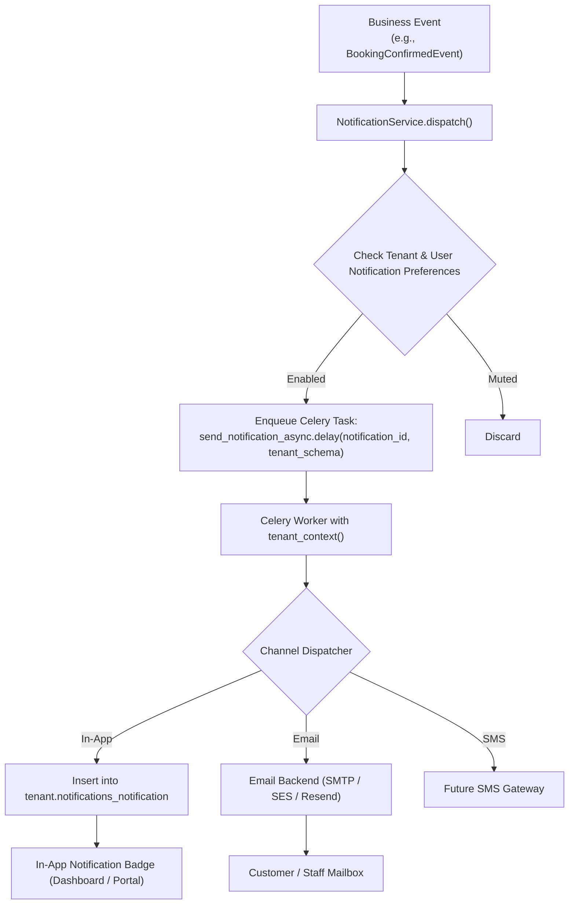

# Notification & Email Pipeline Architecture

## 1. Architectural Strategy

1. **Non-Blocking Execution**: Email generation and notification dispatching are strictly offloaded to asynchronous Celery workers. HTTP request handlers never wait on SMTP connections or 3rd-party notification APIs.
2. **Multi-Channel Pipeline**: Dispatches through In-App alerts, transactional HTML email, with extensible abstractions for SMS (Twilio) and Web Push.
3. **Tenant-Branded Templates**: Email layouts dynamically inject tenant brand colors, logo, company address, support phone, and custom header/footer copy based on the tenant schema where the event originated.

---

## 2. Notification Pipeline Flow



---

## 3. Transactional Email Template Catalog

| Template Key | Trigger Event | Primary Recipient | Content Summary |
| :--- | :--- | :--- | :--- |
| `welcome` | New user signup | User | Account activation & getting started guide |
| `verification` | Email verification request | User | Secure 6-digit PIN / verification token link |
| `password_reset` | Password reset requested | User | Expiring secure password reset URL |
| `booking_confirmation` | Booking confirmed & paid | Customer | Confirmation code, vehicle specs, branch pickup directions, calendar invite (.ics) |
| `booking_cancellation` | Booking cancelled | Customer & Staff | Cancellation notice, refund details, policy breakdown |
| `booking_reminder` | 24 hours prior to pickup | Customer | Branch location, required documents (DL, credit card), vehicle details |
| `payment_receipt` | Payment captured | Customer | Itemized breakdown of charges, tax invoice, payment ref |
| `payment_failure` | Gateway charge rejected | Customer | Reason for decline, secure retry payment link |
| `pickup_reminder` | 2 hours prior to pickup | Customer | Key collection desk instructions, contact number |
| `return_reminder` | 4 hours prior to return | Customer | Return depot location, fuel policy reminder, operating hours |
| `overdue_notice` | Return datetime + 1hr overdue | Customer & Staff | Immediate return request, late penalty warning |
| `tenant_invitation` | Staff invited to company | Staff Member | Role description, invitation link to join team |

---

## 4. De-duplication & Idempotency Safeguards

To prevent email bombardment caused by task retries or automated cron runs:
```python
class NotificationLog(models.Model):
    id = models.UUIDField(primary_key=True, default=uuid.uuid4)
    event_key = models.CharField(max_length=120) -- e.g. "pickup_reminder:BK-984210"
    recipient = models.EmailField()
    channel = models.CharField(max_length=20)
    sent_at = models.DateTimeField(auto_now_add=True)

    class Meta:
        constraints = [
            models.UniqueConstraint(
                fields=["event_key", "recipient", "channel"],
                name="unique_notification_event"
            )
        ]
```
If a worker crashes after sending but before acknowledging, the database unique constraint prevents duplicate dispatch on retry.
