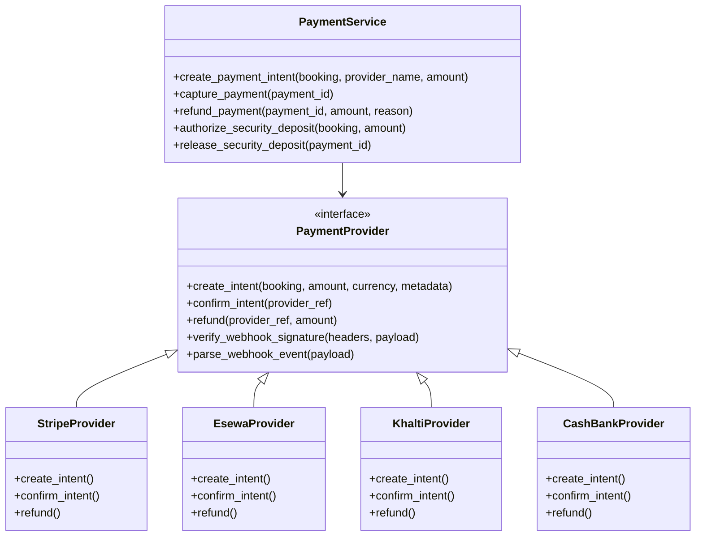
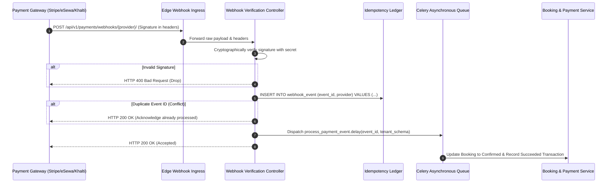

# Payment Gateway Abstraction & Ledger Architecture

## 1. Architectural Principles

1. **Strict PCI-DSS Compliance**: Under zero circumstances does the platform handle, store, or transmit raw card numbers, CVVs, or expiration dates. All payment intake occurs via client-side tokenization (e.g. Stripe Elements) or hosted redirect gateways (e.g. eSewa, Khalti, PayPal).
2. **Provider Abstraction**: A unified `PaymentProvider` interface abstracts all gateway-specific API communication behind uniform contracts.
3. **Idempotency & Replay Defense**: All mutating payment intents and incoming webhook events are recorded in an immutable ledger with unique constraint verification.

---

## 2. Payment Provider Strategy Pattern

---

## 3. Webhook Ingestion & Idempotency Pipeline

Webhooks are untrusted inbound requests. They require rigorous verification and idempotent handling:

---

## 4. Security Deposit Authorization Lifecycle

Unlike immediate payment charges, car rental requires pre-authorizing security deposits:
1. **Pre-Authorization**: At pickup, deposit amount (e.g. $500) is placed on hold using `capture_method="manual"`.
2. **Hold Window**: Valid for 7 days (Stripe) or re-authorized automatically for long rentals.
3. **Settlement**:
   - **No Damages / Full Return**: Hold is cancelled immediately via API call. Renter pays zero.
   - **Tolls / Late Return / Scratches**: Partial capture executed for the exact damage amount; remaining balance released.
