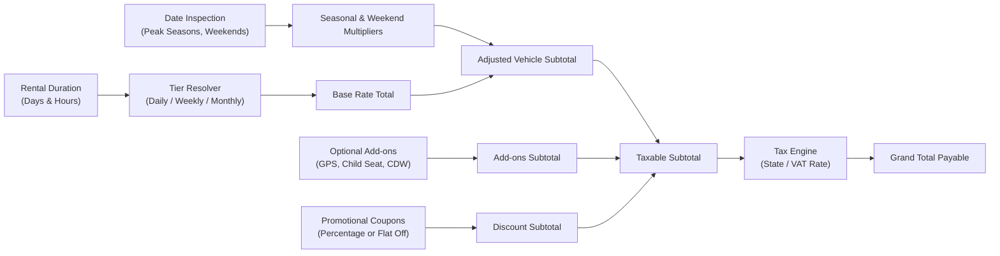

# Dynamic Pricing Engine Architecture

## 1. Design Principles

1. **Decoupled Service Layer**: All rate computations are encapsulated in `PricingEngineService`. Views and serializers never contain arithmetic pricing logic.
2. **Deterministic & Transparent**: Every generated quote returns a complete line-item breakdown (base charges, seasonal adjustments, extras, taxes, deposits).
3. **Tenant-Configurable**: Each car rental company defines its own tax rates, currency, duration thresholds, add-on inventory, and seasonal calendars.

---

## 2. Pricing Breakdown Model

```text
Final Total = (Base Rate + Adjustments + Add-ons - Discounts) + Taxes
Security Deposit = Flat Deposit OR Tier-Based Vehicle Deposit (Authorized, not billed)
```



---

## 3. Tier & Duration Resolution

Rentals are charged on a 24-hour cycle. Partial days exceeding a configurable grace period (e.g. 2 hours) roll over to a full additional day.

- **Daily Rate**: Used for rentals lasting 1 to 6 days.
- **Weekly Rate**: Automatically applied when rental duration is 7 to 29 days (discounted effective daily rate).
- **Monthly Rate**: Automatically applied when duration is 30+ days (commercial fleet long-term rate).

```python
def resolve_duration_units(pickup_dt: datetime, return_dt: datetime, grace_hours: int = 2) -> dict:
    total_seconds = (return_dt - pickup_dt).total_seconds()
    total_hours = total_seconds / 3600.0
    full_days = int(total_hours // 24)
    remainder_hours = total_hours % 24
    
    billable_days = full_days
    if remainder_hours > grace_hours:
        billable_days += 1
    elif remainder_hours > 0 and billable_days == 0:
        billable_days = 1 # Minimum 1 day charge
        
    return {
        "billable_days": billable_days,
        "is_weekly": 7 <= billable_days < 30,
        "is_monthly": billable_days >= 30,
    }
```

---

## 4. Seasonal & Weekend Multipliers

Tenants can establish date ranges corresponding to peak demand (e.g., Summer Peak, Winter Ski Season, New Year's Eve):
- **Seasonal Rate Rule**: Multiplies base rate by e.g. `1.30` (+30%) for dates falling inside the holiday window.
- **Weekend Surge**: Applies a weekend surcharge factor (e.g. `1.15`) for Fridays, Saturdays, and Sundays.
- **Branch Surcharge**: Pickups from premium locations (e.g. Airport Branch vs Downtown Depot) can apply a flat concession fee (e.g., $25).

---

## 5. Add-Ons & Extras Catalog

Tenants define extras with pricing types:
- **`per_day`**: Daily insurance (Collision Damage Waiver), GPS navigation, child safety seat.
- **`per_rental`**: Cleaning fee, airport drop-off fee, cross-border permit.
- **`per_unit`**: Wi-Fi hotspot, ski roof rack.

---

## 6. Quote Response Contract

```json
{
  "currency": "USD",
  "rental_duration": {
    "pickup_datetime": "2026-10-01T10:00:00Z",
    "return_datetime": "2026-10-08T10:00:00Z",
    "billable_days": 7,
    "pricing_tier": "weekly"
  },
  "line_items": [
    {
      "description": "Base Rental (Weekly Rate x 7 days)",
      "amount": "560.00"
    },
    {
      "description": "Peak Autumn Season Adjustment (+10%)",
      "amount": "56.00"
    },
    {
      "description": "Full Comprehensive Insurance (CDW @ $15/day)",
      "amount": "105.00"
    },
    {
      "description": "Promotional Discount (Promo Code: AUTUMN10)",
      "amount": "-72.10"
    }
  ],
  "subtotal": "648.90",
  "tax_amount": "51.91",
  "tax_rate_percent": "8.00",
  "total_payable": "700.81",
  "security_deposit_authorized": "500.00"
}
```
