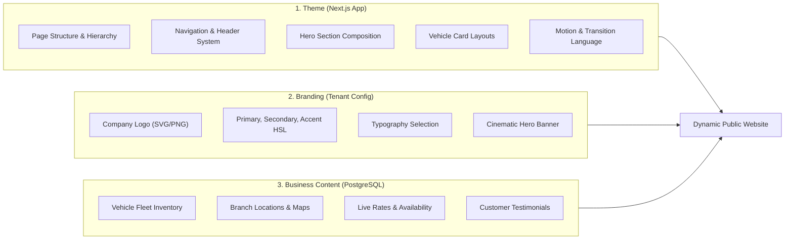

# Frontend Multi-Theme Engine Architecture

## 1. Architectural Separation: Theme vs Branding vs Content

To guarantee complete design flexibility without risking data integrity, three concerns are strictly decoupled:

```text
       Theme (Next.js Code)
                 +
       Branding (Tenant Identity Tokens)
                 +
       Content (Fleet & Branch Data)
                 =
       Unique Tenant Website Experience
```



### 1.1 Invariant Guarantee
**Switching a tenant's active theme NEVER deletes, migrates, or corrupts business data.** The theme is purely a presentation engine consuming the normalized tenant API.

---

## 2. Next.js Theme Registry & Dynamic Dispatcher

Themes are registered in a centralized registry in `frontend/src/themes/`:

```typescript
// frontend/src/lib/themes/registry.ts
import { ComponentType } from "react";

export interface ThemeDefinition {
  id: string;
  name: string;
  description: string;
  thumbnailUrl: string;
  components: {
    Layout: ComponentType<{ children: React.ReactNode }>;
    HeroSection: ComponentType<HeroProps>;
    FleetCatalog: ComponentType<FleetProps>;
    VehicleDetail: ComponentType<VehicleDetailProps>;
    BookingFlow: ComponentType<BookingProps>;
    Footer: ComponentType<FooterProps>;
  };
}

export const themeRegistry: Record<string, () => Promise<ThemeDefinition>> = {
  luxury: () => import("@/themes/luxury").then((m) => m.luxuryTheme),
  modern: () => import("@/themes/modern").then((m) => m.modernTheme),
  classic: () => import("@/themes/classic").then((m) => m.classicTheme),
  adventure: () => import("@/themes/adventure").then((m) => m.adventureTheme),
  urban: () => import("@/themes/urban").then((m) => m.urbanTheme),
  minimal: () => import("@/themes/minimal").then((m) => m.minimalTheme),
};
```

---

## 3. Initial Theme Specifications

### 3.1 Theme: Luxury
- **Visual Direction**: High-end automotive concierge experience (Bentley, Aston Martin, Porsche vibe).
- **Typography**: Refined Serif headlines (`Playfair Display` or `Cormorant Garamond`) paired with elegant geometric sans (`Inter` or `Plus Jakarta Sans`).
- **Composition**: Deep dark slate/obsidian canvas (`#0A0B0E`), champagne gold / warm bronze accents (`#D4AF37`), expansive whitespace, editorial staggered layouts.
- **Card Design**: Panoramic aspect ratio with subtle elevation on hover, glass-tinted spec badges, muted dark borders.
- **Motion**: Cinematic slow ease reveals, subtle image parallax, graceful modal unveilings.

### 3.2 Theme: Modern
- **Visual Direction**: Clean, contemporary Scandinavian mobility brand (Polestar, Tesla, Lynk & Co vibe).
- **Typography**: Bold, purposeful neo-grotesque typography (`Plus Jakarta Sans` or `Space Grotesk`).
- **Composition**: Crisp light/dark adaptive modes, sharp geometric grids, high-contrast monochrome with vibrant electric cobalt accents (`#2563EB`).
- **Card Design**: Compact, data-dense cards highlighting instant booking, transmission tag, and live daily price counter.
- **Motion**: Snappy springs, instant hover feedback, fluid filter drawer transitions.

---

## 4. Non-Destructive Live Preview Engine

When a tenant admin explores new themes in the dashboard:
1. Admin selects **"Preview Modern Theme"**.
2. Dashboard opens the public site with an ephemeral signed query token or preview cookie: `?theme_preview=modern&preview_sig=...`
3. Next.js Edge Middleware intercepts the request, overrides the resolved theme for that browser session only, without altering the tenant's production database record.
4. An unobtrusive floating preview bar enables the admin to test booking flows, inspect fleet layouts, and either **"Activate Theme"** (persisting to DB) or **"Exit Preview"**.
